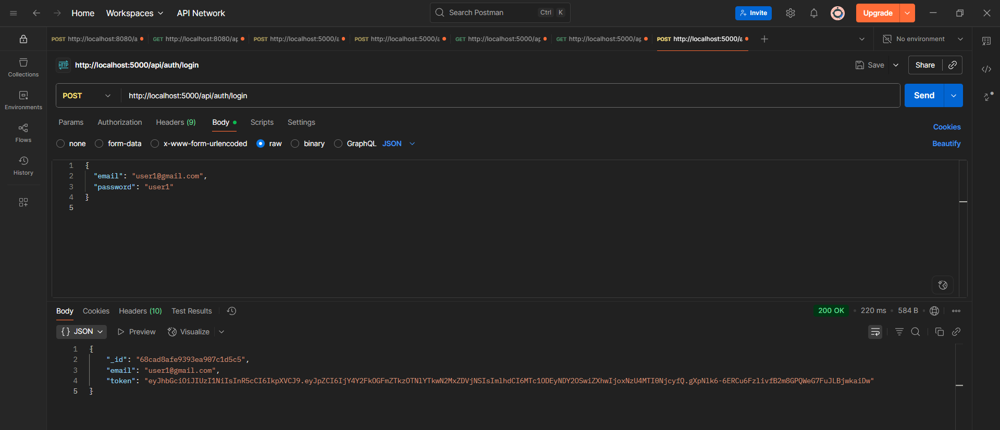
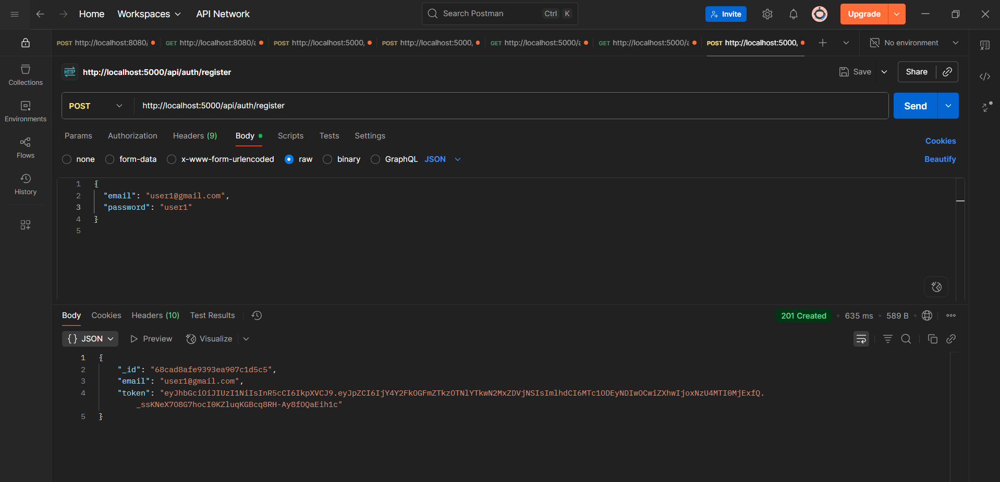
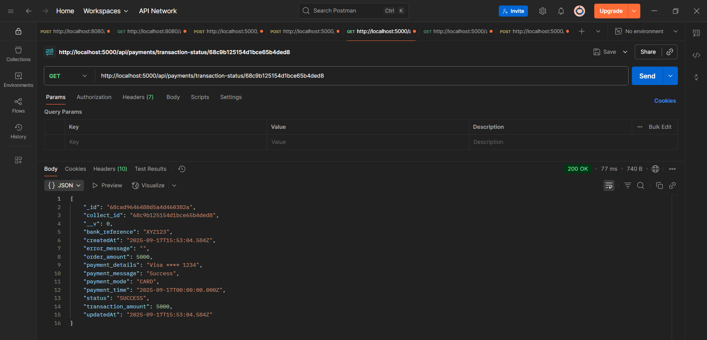
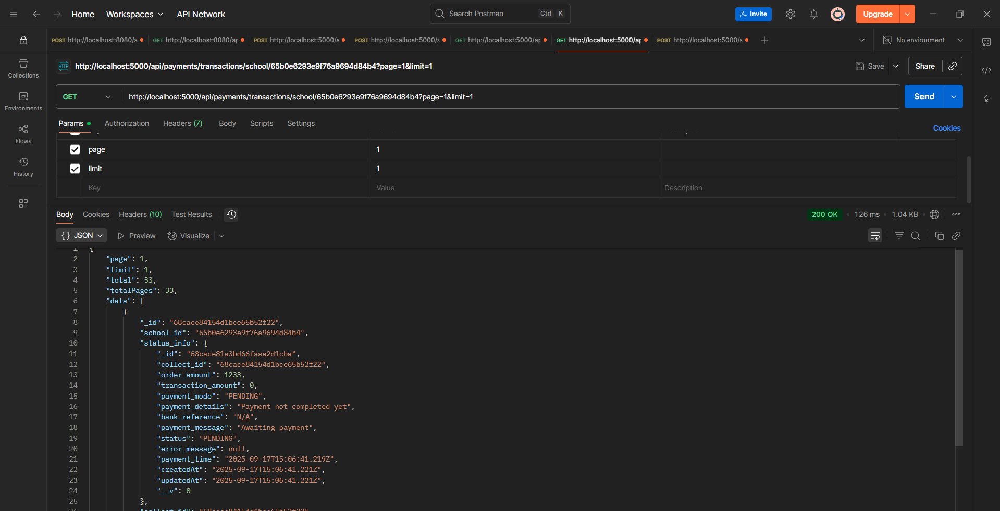
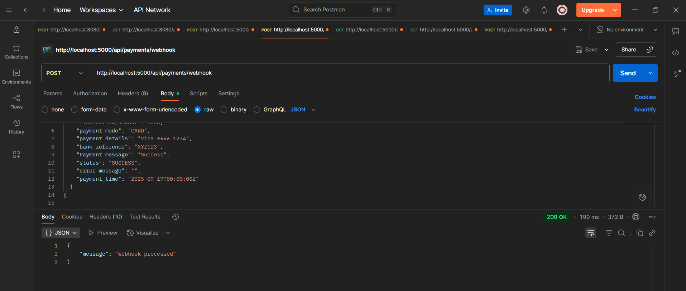

# Edviron Backend (Node.js + Express + MongoDB)

This is the **backend** of the Edviron project, powering the educational payment and transaction management platform. It is built using **Node.js**, **Express**, and **MongoDB** with secure authentication, payment handling, and detailed transaction management.

---

## Table of Contents

- [Project Overview](#project-overview)  
- [Features](#features)  
- [API Endpoints](#api-endpoints)  
- [Screenshots](#screenshots)  
- [Installation](#installation)  
- [Usage](#usage)  
- [Folder Structure](#folder-structure)  
- [Technologies Used](#technologies-used)  
- [Contributing](#contributing)  
- [License](#license)  

---

## Project Overview

The backend handles:

- User authentication and authorization (JWT + Bcrypt)  
- Payment processing and webhooks  
- Transaction creation, retrieval, filtering, and pagination  
- Secure data handling with MongoDB  

It integrates seamlessly with the **Edviron Frontend** to provide a complete educational payment platform.

---

## Features

- **User Authentication** – Secure sign-up and login using JWT and Bcrypt  
- **Transactions** – Create, view, filter, and paginate transactions  
- **Payments** – Payment integration with webhooks support  
- **Security** – Password hashing, token verification, and protected routes  

---

## API Endpoints

Some of the main API endpoints:

| Endpoint                   | Method | Description                         |
|----------------------------|--------|------------------------------------ |
| `/api/users/register`      | POST   | Register a new user                 |
| `/api/users/login`         | POST   | Login user and generate JWT         |
| `/api/payments/create`     | POST   | Create a new payment                |
| `/api/transactions`        | GET    | Get all transactions (with filter)  |
| `/api/transactions/:id`    | GET    | Get transaction by ID               |
| `/api/webhooks`            | POST   | Handle payment gateway webhooks     |

---

## Screenshots

### Authentication
  
  

### Transactions
  
  

### Payment Webhooks
  

---

## Installation

Follow these steps to set up the backend locally:

1. **Clone the repository:**

```bash
git clone https://github.com/yourusername/edviron-backend.git

cd edviron-backend

npm install

nodemon index.js